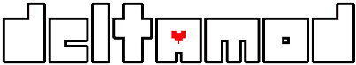
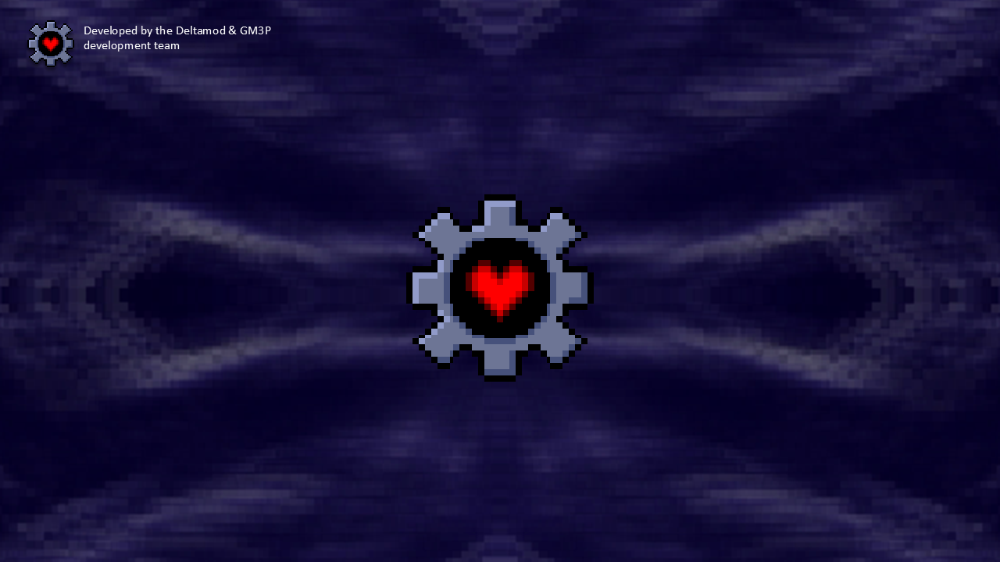
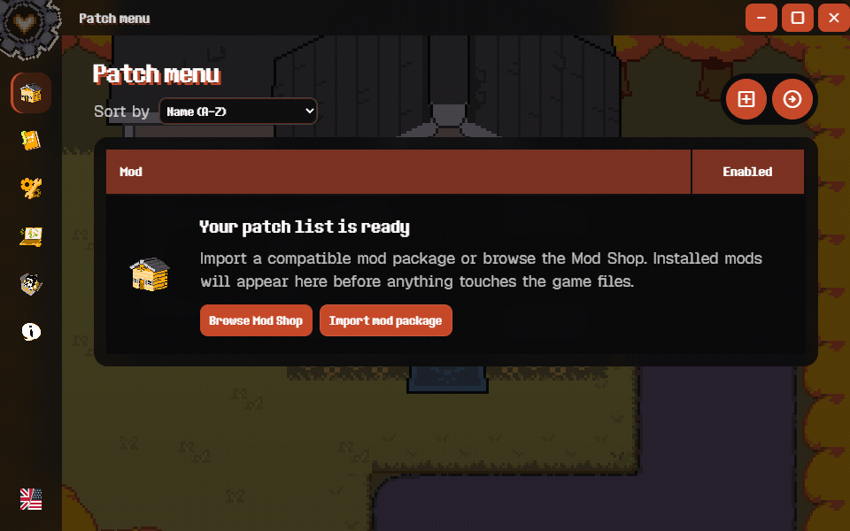
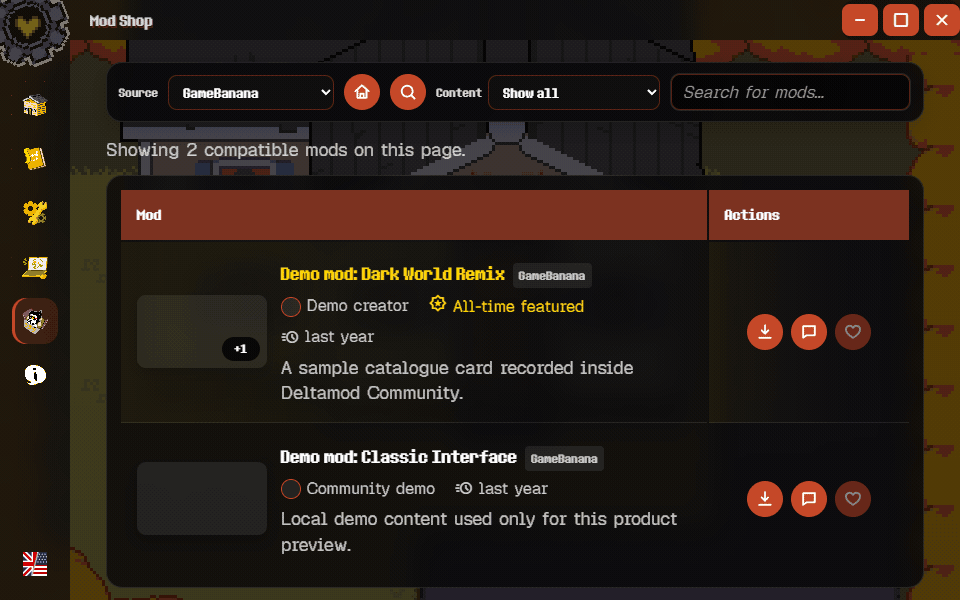
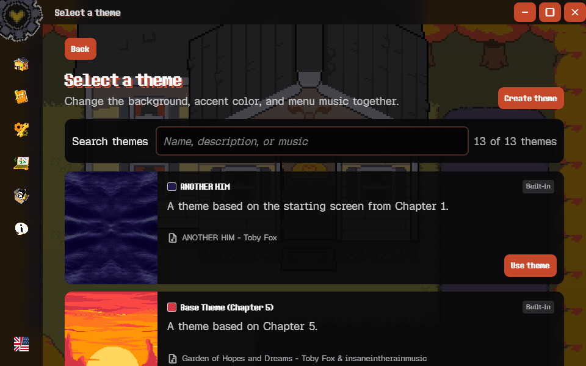
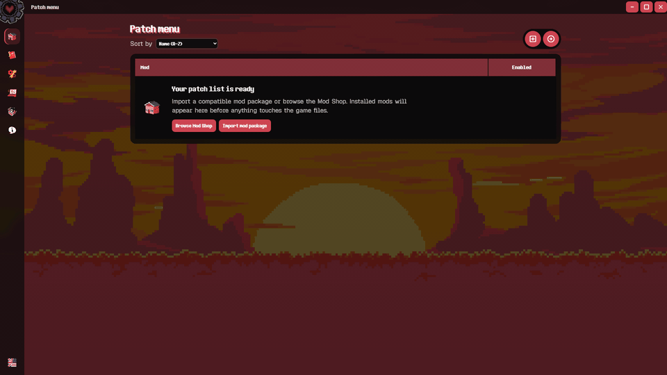

<p align="center">
  
</p>

<h1 align="center">Deltamod Community</h1>

<p align="center">
  <strong>Your mods. Your worlds. One launcher.</strong><br>
  A community-built mod manager for DELTARUNE, UNDERTALE,<br>and other supported GameMaker games.
</p>

<p align="center">
  <a href="https://github.com/cmdr-chara/deltamod/releases/latest"></a>
  <a href="https://github.com/cmdr-chara/deltamod/releases"></a>
  <a href="https://github.com/cmdr-chara/deltamod/stargazers"></a>
  <a href="https://github.com/cmdr-chara/deltamod/issues"></a>
  <a href="./LICENSE.txt"></a>
</p>

<p align="center">
  <a href="https://github.com/cmdr-chara/deltamod/releases/latest"><strong>Download Deltamod</strong></a>
  &nbsp;•&nbsp;
  <a href="#supported-games">Supported games</a>
  &nbsp;•&nbsp;
  <a href="https://github.com/cmdr-chara/deltamod/issues/new/choose">Get help</a>
</p>

<p align="center">
  
</p>

---

## Why this fork exists

Deltamod Community is an independent fork created in response to concerns about censorship in the original repository. We do not support GameBanana's restrictions on mods, and we believe in freedom of creative expression while still respecting applicable laws, platform rules, and community safety.

## Modding, without the busywork

Deltamod Community brings compatible mods, game installations, and separate mod setups together in one place. Browse community catalogues, import a local archive, switch profiles, and let Deltamod handle the installation flow.

| Discover | Install | Organize |
| :---: | :---: | :---: |
| Browse supported **GameBanana** mods and **ModDB** listings. | Import archives or install compatible packages with guided progress. | Keep multiple game installations, collections, and mod setups separate. |

## See it in action

### One home for every setup

<p align="center">
  
</p>

<p align="center"><sub>Move between your patch list, installed mods, game installations, and collections.</sub></p>

### Discover, preview, install

<p align="center">
  
</p>

<p align="center"><sub>Browse the Mod Shop, open image galleries, and follow download and import progress. Catalogue entries shown here use local demo data.</sub></p>

### Make it feel like yours

<p align="center">
  
</p>

<p align="center"><sub>Switch complete visual themes and choose between eight interface languages.</sub></p>

### A quick tour

<p align="center">
  
</p>

<p align="center"><sub>Selected screens from the local Playwright smoke flow in the built-in Base Theme: home, mod list, settings, installation manager, catalogue, and credits.</sub></p>

### What it can do

- **Install and remove mods** packaged for Deltamod-compatible games.
- **Import local mod archives** without relying on an online catalogue.
- **Apply UndertaleModTool `.csx` patches** after an explicit safety warning.
- **Browse GameBanana inside the app** and open supported ModDB downloads.
- **Connect Nexus Mods with OAuth 2.0 + PKCE** and browse its catalogue.
- **Manage multiple installations and profiles** for different mod setups.
- **Import official Deltamod data** into an independent community profile.
- **Speak your language** with English, Italian, French, German, Spanish, Portuguese, Polish, and Japanese localizations.

> [!NOTE]
> Nexus Mods sign-in is available from **Options → Nexus Mods**. Premium accounts can download compatible archives through the API; non-premium accounts may need to confirm a download on the Nexus Mods website and then import the saved archive. GameBanana, ModDB, and local imports work without a Nexus Mods account.

Nexus Mods uses OAuth 2.0 Authorization Code with PKCE S256. The desktop callback is fixed at `http://127.0.0.1:52817/callback`, binds only to the IPv4 loopback interface, verifies `state`, and closes after authorization; it never falls back to a dynamic port. Access and refresh tokens are encrypted with Electron's secure storage or stored in the native OS keyring, refreshed before expiry, and sent only as Bearer tokens to the Nexus Mods API. Catalogue requests remain limited to one bounded result page, and quota responses honor the server's `Retry-After` value. Manually supplied credentials are not accepted.

The registered public client ID is configured as `nexusOAuthClientId` in `package.json`. Local development can temporarily override it through `DELTAMOD_NEXUS_OAUTH_CLIENT_ID`; no client secret is used or expected for this desktop PKCE flow.

## Download

The current stable release is **Deltamod Community 2.0.12**, powered by the Tauri desktop shell.

<p align="center">
  <a href="https://github.com/cmdr-chara/deltamod/releases/tag/community-v2.0.12">
    
  </a>
</p>

Choose the asset matching your operating system and architecture. Windows and macOS packages are currently unsigned because this community project does not have paid platform-signing credentials.

> [!IMPORTANT]
> Download only from the official GitHub release page and verify the file against the attached `SHA256SUMS.txt`. Deltamod does not currently update itself; future versions must be installed manually.

<details>
<summary><strong>Windows installation</strong></summary>

1. Download and open **Deltamod.Community.Setup.exe**, the Deltamod-themed installer.
2. If Windows reports an unknown publisher, first confirm that its SHA-256 hash matches `SHA256SUMS.txt` on the release page.
3. Complete the installer and launch **Deltamod Community**.

</details>

<details>
<summary><strong>macOS installation</strong></summary>

1. Download the DMG for your Mac, open it, and move **Deltamod Community** to Applications.
2. Launch the app from Applications.

The app is not notarized. Verify the DMG checksum before deciding whether to allow it in **System Settings → Privacy & Security**. To identify your architecture, open **Apple menu → About This Mac** and look for **Chip: Apple** or **Processor: Intel**.

</details>

<details>
<summary><strong>Linux installation</strong></summary>

Install the Debian package with your graphical package manager, or from a terminal:

```console
sudo apt install ./deltamod-community-*.deb
```

</details>

Files ending in `.blockmap` or `.yml`, G3MTool source bundles, and GitHub's automatic source archives are intended for development or release infrastructure—not normal installation.

## Supported games

| Game | Support |
| --- | :---: |
| **DELTARUNE** | ✅ |
| **DELTARUNE Demo** | ✅ |
| **DELTARUNE Demo (LTS)** | ✅ |
| **UNDERTALE** | ✅ |
| **Undertale Yellow** | ✅ |
| **Pizza Tower** | ✅ |

Individual mods may target only specific game versions. Always read the mod author's compatibility notes before installing.

## Platform status

| Platform | Status | Notes |
| --- | :---: | --- |
| Windows x64 | **Stable** | Recommended platform. |
| Linux x64 | **Experimental** | Distributed as an AppImage. |
| macOS Apple Silicon | **Experimental** | Native app; `.csx` script patches are unavailable. |
| macOS Intel | **Experimental** | Native app with `.csx` patch support. |
| Wine / CrossOver | **Unofficial** | May work, but is not a supported release target. |

UndertaleModTool `.csx` patches require Windows x64, Linux x64, or an Intel Mac because upstream does not publish an Apple Silicon CLI binary. Deltamod snapshots the complete mod directory before script execution, allowing companion files to load from the staged script path without exposing a partially changed package.

## Project resources

- [Report a bug](https://github.com/cmdr-chara/deltamod/issues/new/choose)
- [Read the contribution guide](./CONTRIBUTING.md)
- [Read the Code of Conduct](./CODE_OF_CONDUCT.md)
- [Get support](./SUPPORT.md)
- [Browse all releases](https://github.com/cmdr-chara/deltamod/releases)
- [Read the security policy](./SECURITY.md) for vulnerability reports

## Development

You will need [Node.js 22](https://nodejs.org/). Tauri builds additionally require the platform prerequisites for Tauri development.

```console
git clone https://github.com/cmdr-chara/deltamod.git
cd deltamod
npm ci
npm run dev
```

### Quality checks

```console
npm test
npm run typecheck
npm run security:audit
```

### Desktop builds

| Target | Command |
| --- | --- |
| Windows | `npm run build-windows` |
| Linux | `npm run build-linux` |
| macOS | `npm run build-macos` |
| Tauri | `npm run build:tauri` |

Build output is written to `dist/`. Patching uses [G3MTool](https://github.com/y114git/G3MTool) and the [UndertaleModTool CLI](https://github.com/UnderminersTeam/UndertaleModTool); run `npm run acquire:g3mtool` and `npm run acquire:undertale-mod-tool` to download and verify the pinned builds.

For release requirements and third-party details, see [RELEASE-GATE.md](./docs/RELEASE-GATE.md) and [THIRD_PARTY_NOTICES.md](./THIRD_PARTY_NOTICES.md).

## License

Deltamod Community is licensed under the [European Union Public Licence 1.2](./LICENSE.txt). Attribution and bundled third-party software are documented in [NOTICE.md](./NOTICE.md) and [THIRD_PARTY_NOTICES.md](./THIRD_PARTY_NOTICES.md).

---

<p align="center">
  Made with <span aria-label="determination">❤️</span> by the Deltamod community.<br>
  <sub>An independent fan project. Not affiliated with or endorsed by Toby Fox.</sub>
</p>
